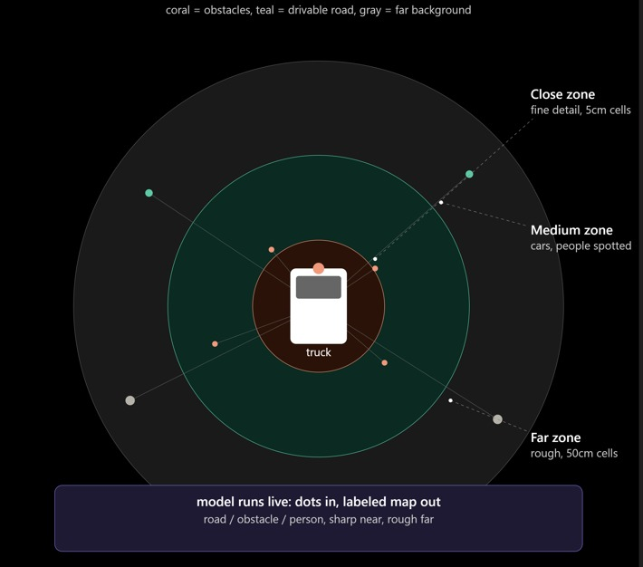
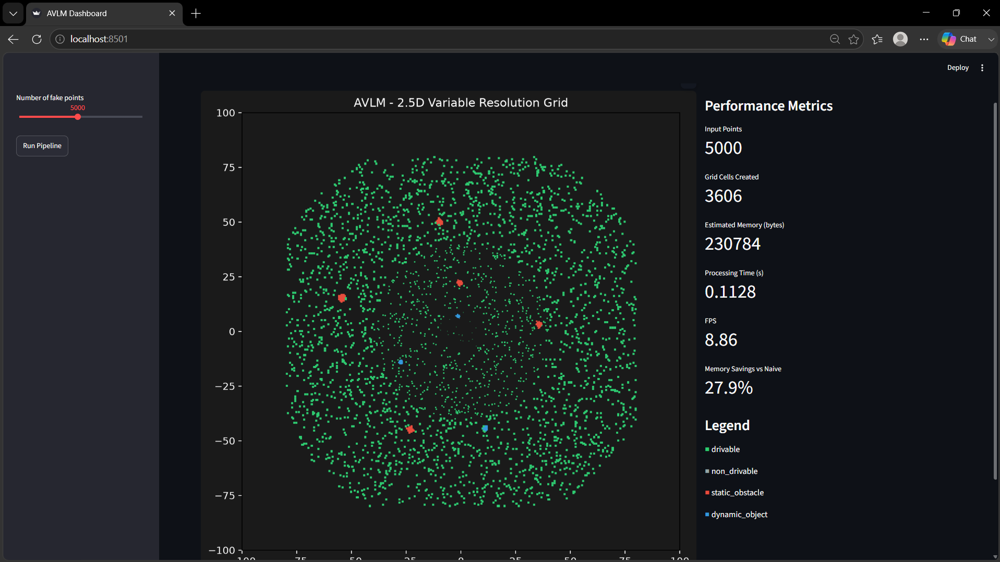

```
 █████╗ ██╗   ██╗██╗     ███╗   ███╗
██╔══██╗██║   ██║██║     ████╗ ████║
███████║██║   ██║██║     ██╔████╔██║
██╔══██║╚██╗ ██╔╝██║     ██║╚██╔╝██║
██║  ██║ ╚████╔╝ ███████╗██║ ╚═╝ ██║
╚═╝  ╚═╝  ╚═══╝  ╚══════╝╚═╝     ╚═╝
```

### Adaptive Variable-Resolution 2.5D Lidar Mapping


<p align="center">
  
</p>

# AVLM — Adaptive Variable-Resolution 2.5D LiDAR Mapping

<p align="center">
  <strong>Adaptive Variable-Resolution 2.5D LiDAR Mapping for Dynamic Environment Perception</strong>
</p>

<p align="center">
  Raw LiDAR Point Clouds → Terrain & Object Classification → Adaptive Quadtree Grid → Real-Time Visualization
</p>

---
## 📖 Overview

**AVLM (Adaptive Variable-Resolution 2.5D LiDAR Mapping)** is a deep learning-based perception and mapping pipeline designed to convert raw LiDAR point clouds into an adaptive, **foveated 2.5D grid map**.

The system combines:

- Terrain analysis
- Object detection
- Label fusion
- Quadtree-based variable-resolution mapping
- Real-time visualization

The key idea behind AVLM is:

> **High resolution where detail matters, lower resolution where it doesn't.**

This allows the system to maintain fine spatial detail near the vehicle while using coarser cells farther away, reducing memory usage and computational requirements compared with a uniformly high-resolution grid.

---

## ✨ Key Capabilities

### 🌍 Terrain Analysis

Classifies surfaces into:

- 🟢 **Drivable**
- 🔴 **Non-drivable**

### 🚧 Object Detection

Identifies and categorizes objects into:

- 🔵 **Static objects** — walls, poles, infrastructure, etc.
- 🟠 **Dynamic objects** — pedestrians, vehicles, and other moving objects

### 🗺️ Adaptive Spatial Grid

AVLM uses a custom **quadtree-based variable-resolution 2.5D grid engine**.

| Region | Cell Resolution |
|---|---:|
| 0–10 m | **5 cm** |
| 10–40 m | **20 cm** |
| 40–100 m | **50 cm** |

### 📊 Real-Time Visualization

The Streamlit dashboard provides:

- Live FPS monitoring
- Memory usage
- Terrain classification
- Object classification
- Variable-resolution grid visualization
- Processing performance metrics
---

## ⚙️ How It Works

AVLM processes LiDAR data through the following pipeline:

```text
                 ┌──────────────────────┐
                 │   Raw LiDAR Points   │
                 └──────────┬───────────┘
                            │
                            ▼
                 ┌──────────────────────┐
                 │    Preprocessing     │
                 │ Noise Removal        │
                 │ Downsampling         │
                 └──────────┬───────────┘
                            │
                            ▼
                 ┌──────────────────────┐
                 │ Coordinate Alignment │
                 │ Vehicle-Centric Frame│
                 └──────────┬───────────┘
                            │
                  ┌─────────┴─────────┐
                  │                   │
                  ▼                   ▼
        ┌─────────────────┐   ┌─────────────────┐
        │ Terrain Analysis│   │ Object Detection│
        │                 │   │                 │
        │ Drivable        │   │ Static          │
        │ Non-Drivable    │   │ Dynamic         │
        └────────┬────────┘   └────────┬────────┘
                 │                     │
                 └──────────┬──────────┘
                            ▼
                 ┌──────────────────────┐
                 │     Label Fusion     │
                 │ Final Classification │
                 └──────────┬───────────┘
                            │
                            ▼
                 ┌──────────────────────┐
                 │ Variable-Resolution  │
                 │      2.5D Grid       │
                 │                      │
                 │ 5 cm  → 0–10 m       │
                 │ 20 cm → 10–40 m      │
                 │ 50 cm → 40–100 m     │
                 └──────────┬───────────┘
                            │
                            ▼
                 ┌──────────────────────┐
                 │ Streamlit Dashboard  │
                 │ FPS • Memory • Map   │
                 └──────────────────────┘

---
## 📈 Results

### AVLM Results

The following results represent the **AVLM (Adaptive Variable-Level Mapping)** approach.

| Metric | AVLM Result |
|---|---|
| **Memory Savings** | ~31% vs. uniform high-resolution grid |
| **Core Pipeline Performance** | ~29 FPS |
| **Live Rendering Performance** | ~12 FPS |
| **Pipeline Status** | Fully automated & tested end-to-end |

> **Note:** These results are based on simulated data. Performance and accuracy may change when evaluated on real-world datasets.

---

## 🖥️ Dashboard Preview

### Normal Implementation

The dashboard provides a real-time visualization of the **normal 2.5D variable-resolution grid implementation** that we have developed.

<p align="center">
  
</p>

### Dashboard Features

- 🗺️ Real-time 2.5D grid visualization
- 🌍 Drivable / non-drivable terrain visualization
- 🚧 Static / dynamic object visualization
- ⚡ Live FPS monitoring
- 💾 Memory usage monitoring
- 📊 Pipeline performance metrics

---

## 🧠 Core Innovation — Foveated Variable-Resolution Mapping

The core innovation of AVLM is its **quadtree-based variable-resolution 2.5D grid**.

Instead of representing the complete environment using a uniform cell size, AVLM changes the spatial resolution according to the distance from the sensor.

```text
                 Vehicle
                    │
                    ▼
              ┌───────────┐
              │   5 cm    │
              │ 0–10 m    │
              │ High      │
              │ Detail    │
              └─────┬─────┘
                    │
                    ▼
              ┌───────────┐
              │  20 cm    │
              │ 10–40 m   │
              │ Medium    │
              │ Detail    │
              └─────┬─────┘
                    │
                    ▼
              ┌───────────┐
              │  50 cm    │
              │ 40–100 m  │
              │ Coarse    │
              │ Detail    │
              └───────────┘

---

## 🏗️ Architecture

```text
                         ┌──────────────┐
                         │  LiDAR Data  │
                         └──────┬───────┘
                                │
                                ▼
                    ┌─────────────────────┐
                    │   Preprocessing     │
                    │                     │
                    │ Loading             │
                    │ Filtering           │
                    │ Downsampling        │
                    └──────────┬──────────┘
                               │
                               ▼
                    ┌─────────────────────┐
                    │ Coordinate Alignment│
                    │                     │
                    │ Vehicle-Centric     │
                    │ Coordinate Frame    │
                    └──────────┬──────────┘
                               │
                 ┌─────────────┴─────────────┐
                 │                           │
                 ▼                           ▼
       ┌──────────────────┐       ┌──────────────────┐
       │ Terrain Analysis │       │ Object Detection │
       │                  │       │                  │
       │ Drivable         │       │ Static           │
       │ Non-Drivable     │       │ Dynamic          │
       └─────────┬────────┘       └─────────┬────────┘
                 │                           │
                 └─────────────┬─────────────┘
                               │
                               ▼
                    ┌─────────────────────┐
                    │       Fusion        │
                    │                     │
                    │ Terrain + Object    │
                    │ Labels              │
                    └──────────┬──────────┘
                               │
                               ▼
                    ┌─────────────────────┐
                    │    Grid Engine      │
                    │                     │
                    │ Quadtree-Based      │
                    │ Variable Resolution │
                    │ 2.5D Grid           │
                    └──────────┬──────────┘
                               │
                               ▼
                    ┌─────────────────────┐
                    │   Visualization     │
                    │                     │
                    │ Streamlit Dashboard │
                    │ + Performance       │
                    │ Metrics             │
                    └─────────────────────┘

---

## 🛠️ Tech Stack

| Technology | Purpose |
|---|---|
| **Python** | Core implementation |
| **NumPy** | Numerical and point cloud processing |
| **Streamlit** | Interactive dashboard |
| **Matplotlib** | Visualization |
| **Custom Quadtree Engine** | Variable-resolution spatial mapping |

### Dataset Compatibility

The pipeline is designed for compatibility with **SemanticKITTI**.

---

````markdown
---

## 📦 Requirements & Setup

### Requirements

- Python 3.9+
- pip
- NumPy
- Streamlit
- Matplotlib

### Installation

Clone the repository:

```bash
git clone <repository-url>
cd AVLM
````

Install all dependencies:

```bash
pip install -r requirements.txt
```

### Run the Dashboard

```bash
python -m streamlit run src/visualization/dashboard.py
```

### Run Tests

```bash
python tests/test_grid_engine.py
```

```
```

---

## 📂 Project Structure

```text
AVLM/
│
├── data/
│   └──                         # Dataset files
│
├── src/
│   │
│   ├── preprocessing/
│   │   └──                     # Point cloud loading,
│   │                             # filtering & alignment
│   │
│   ├── terrain_analysis/
│   │   └──                     # Drivable vs
│   │                             # non-drivable classification
│   │
│   ├── object_detection/
│   │   └──                     # Static vs dynamic
│   │                             # object classification
│   │
│   ├── fusion/
│   │   └──                     # Terrain + object
│   │                             # label fusion
│   │
│   ├── grid_engine/
│   │   └──                     # Quadtree variable-
│   │                             # resolution grid
│   │
│   └── visualization/
│       └── dashboard.py        # Streamlit dashboard
│
├── tests/
│   └──                         # Automated test suite
│
├── notebooks/
│   └──                         # Experiments & analysis
│
├── outputs/
│   └──                         # Generated results
│
├── docs/
│   └── images/
│       ├── avlm-banner.png     # Main project image
│       └── dashboard.png       # Dashboard screenshot
│
├── requirements.txt            # Python dependencies
└── README.md                   # Project documentation

---

## 📁 Module Description

| Module | Responsibility |
|---|---|
| `preprocessing/` | LiDAR loading, filtering, downsampling and alignment |
| `terrain_analysis/` | Drivable / non-drivable terrain classification |
| `object_detection/` | Static / dynamic object classification |
| `fusion/` | Combines terrain and object labels |
| `grid_engine/` | Generates the variable-resolution Quadtree 2.5D grid |
| `visualization/` | Streamlit dashboard and performance visualization |
| `tests/` | Automated testing |
| `notebooks/` | Experiments and exploratory analysis |
| `outputs/` | Generated results |
| `docs/` | Documentation and visual assets |

---

## 🚧 Current Status

### ✅ Core Pipeline Complete

The current implementation includes:

- ✅ LiDAR preprocessing
- ✅ Noise removal
- ✅ Downsampling
- ✅ Vehicle-centric coordinate alignment
- ✅ Terrain classification
- ✅ Static / dynamic object classification
- ✅ Point-wise label fusion
- ✅ Variable-resolution 2.5D grid
- ✅ Quadtree-based grid engine
- ✅ Streamlit visualization
- ✅ Performance metrics
- ✅ End-to-end testing

### 🔜 Next Step

The pipeline is ready for **real dataset integration and evaluation**, with **SemanticKITTI** as the next target dataset.

---

## 🔮 Future Scope

Potential future enhancements include:

- Real-time real-world LiDAR processing
- SemanticKITTI evaluation
- Improved terrain segmentation
- Advanced dynamic object tracking
- Multi-frame temporal fusion
- GPU acceleration
- ROS / ROS 2 integration
- Hardware deployment
- Further optimization of memory and inference performance

---

<p align="center">
  <strong>AVLM — Adaptive Variable-Resolution 2.5D LiDAR Mapping</strong>
</p>

<p align="center">
  🚗 Adaptive • 🗺️ Efficient • ⚡ Real-Time • 🤖 Intelligent
</p>

